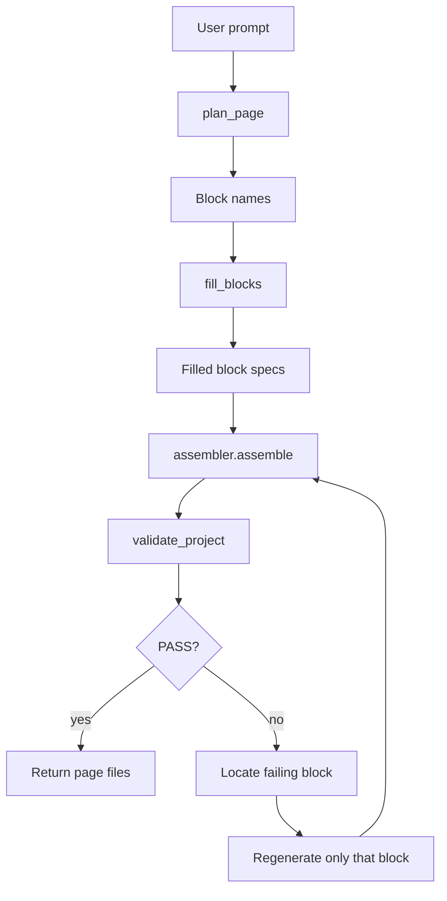

# Semantic Block Orchestrator

## Why split generation

Single-shot generation asks the model to solve layout planning, data modeling, WXML syntax, WXSS isolation, event wiring, and validation constraints in one pass. For a complex mini-program page such as detail + list + form + sticky action bar, one small mistake can fail the whole page: an HTML tag, a `{{}}` function call, a mismatched handler, or one forbidden `wx.*` API.

The orchestrator reduces that risk by generating from tested semantic blocks. Each block is small, has a known data contract, uses prefixed class names, and can be validated by `validators.validate_project(files, full_project=False)` after assembly.

## Architecture

## Step responsibilities

`plan_page(user_prompt, plan_fn=None)` chooses semantic blocks from `blocks/`. In production, `plan_fn` can be an LLM call. Offline, the stub reads every block `meta.json`, scores `keywords` against the prompt, and returns a deterministic block list.

`fill_blocks(blocks, user_prompt, gen_fn=None)` fills each selected block with local mock data. In production, `gen_fn` can specialize the mock data for the prompt. Offline, the block's `meta.json.defaultData` is used.

`assembler.assemble(blocks)` combines all fragments into one page:

- WXML fragments are appended in plan order and wrapped in a single root `<view class="assembled-page">`.
- WXSS rules are merged once, with exact duplicate rules removed.
- JS `data` objects are merged into one `Page({ data })`.
- Event methods are merged into the same `Page` object.

`validate_project(files, full_project=False)` is the only correctness gate. The orchestrator always maps assembled output to:

- `pages/index/index.wxml`
- `pages/index/index.wxss`
- `pages/index/index.js`

If validation fails, the orchestrator assembles each block alone to identify which block is responsible. It then regenerates only that block and retries the full page. The default retry limit is two attempts.

## Conflict handling

Style conflicts are prevented by convention. Every block class uses a block prefix, for example `.hero-banner__title` or `.signup-form__input`. The assembler still de-duplicates identical WXSS rule text, but it does not need to rewrite normal block CSS.

Data conflicts are handled during assembly. If two blocks both define the same data key, the first key is preserved and the later key is namespaced with the block name. The assembler rewrites that later block's WXML binding from `{{title}}` to the namespaced key.

Handler conflicts are also handled during assembly. If two blocks both expose `onTap`, the first method keeps `onTap`, and the later method is renamed with the block name, such as `SecondAction_onTap`. The later block's event binding is rewritten at the same time.

## Design tradeoffs

The block library intentionally uses small page-ready fragments instead of free-form template snippets. That makes every block independently testable with the existing validator after mapping it to the standard page file paths.

The assembler parses a small `BLOCK_SPEC_JSON` payload from each `fragment.js` instead of trying to understand arbitrary JavaScript. This keeps the merge logic deterministic, easy to test, and safe for offline execution.

The default planner and filler are stubs, not a replacement for Gemma. Their job is to prove the full pipeline offline. A real Gemma client can be injected through `plan_fn` and `gen_fn` without changing the surrounding validation and assembly contract.
